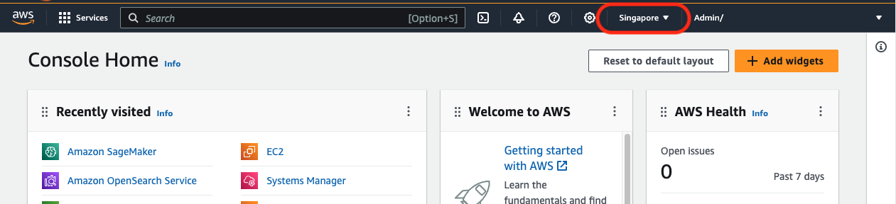
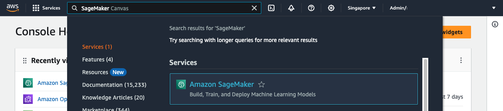

#SageMaker Canvas Lab - Housing Price Prediction

##Agenda

##Overview
In this lab, you will learn how to use Amazon SageMaker Canvas to import and analyze a dataset for housing prices, and build a ML model to predict pricing without having to write a single line of code. Since the prices can be in any range of real values, this ML problem is called "Regression".

The dataset we will use is from the [Housing and Development Board (HDB) Resale Flat Prices](https://beta.data.gov.sg/collections/189/datasets/d_8b84c4ee58e3cfc0ece0d773c8ca6abc/view). You can view the full datasets at the link above, however we're going to use a truncated file so that our model builds faster.

| Column Name         | Data Type |
| ------------------- | :-------: |
| town                |   Text    |
| flat_type           |   Text    |
| block               |   Text    |
| street_name         |   Text    |
| storey_range        |   Text    |
| floor_area_sqm      |  Numeric  |
| flat_model          |   Text    |
| lease_commence_date |   Year    |
| remaining_lease     |   Text    |
| resale_price        |  Numeric  |

##Launch Amazon SageMaker Canvas
Amazon SageMaker Canvas is a new visual, no code capability that allows business analysts to build ML models and generate accurate predictions without writing code or requiring ML expertise. Its intuitive user interface lets you browse and access disparate data sources in the cloud or on-premises, combine datasets with the click of a button, train accurate models, and then generate new predictions once new data is available.

SageMaker Canvas leverages the same technology as Amazon SageMaker to automatically clean and combine your data, create hundreds of models under the hood, select the best performing one, and generate new individual or batch predictions. It supports multiple problem types such as binary classification, multi-class classification, numerical regression, and time series forecasting. These problem types let you address business-critical use cases, such as fraud detection, churn reduction, and inventory optimization, without writing a single line of code.

Here are the one-time steps for onboarding to Amazon SageMaker Canvas using Quick Setup:

1\. Open AWS console and switch to AWS region you would like to use.

2\. In the search bar, type SageMaker and click on Amazon SageMaker.

##Upload the dataset to S3 Bucket
