# SageMaker Canvas Lab - Housing Price Prediction

## Agenda

- [Overview](#overview)
- [Launch Amazon SageMaker Canvas](#launch-amazon-sagemaker-canvas)
- [Setting up your SageMaker Studio environment](#setting-up-your-sagemaker-studio-environment)
- [Creating a Dataset](#creating-a-dataset)
- [Building a Model](#building-a-model)
- [Model Analysis](#model-analysis)
- [Making Predictions](#making-predictions)
- [Cleanup](#cleanup)

## Overview

In this lab, you will learn how to use Amazon SageMaker Canvas to import and analyze a dataset for housing prices, and build a ML model to predict pricing without having to write a single line of code. Since the prices can be in any range of real values, this ML problem is called "Regression".

The dataset we will use is from the [Housing and Development Board (HDB) Resale Flat Prices](https://beta.data.gov.sg/collections/189/datasets/d_8b84c4ee58e3cfc0ece0d773c8ca6abc/view). You can view the full datasets at the link above, however we're going to use a truncated file from the most recent HDB dataset so that our model builds faster.

| Column Name         | Data Type |
| ------------------- | :-------: |
| town                |   Text    |
| flat_type           |   Text    |
| block               |   Text    |
| street_name         |   Text    |
| storey_range        |   Text    |
| floor_area_sqm      |  Numeric  |
| flat_model          |   Text    |
| lease_commence_date |   Year    |
| remaining_lease     |   Text    |
| resale_price        |  Numeric  |

## Launch Amazon SageMaker Canvas

Amazon SageMaker Canvas is a new visual, no code capability that allows business analysts to build ML models and generate accurate predictions without writing code or requiring ML expertise. Its intuitive user interface lets you browse and access disparate data sources in the cloud or on-premises, combine datasets with the click of a button, train accurate models, and then generate new predictions once new data is available.

SageMaker Canvas leverages the same technology as Amazon SageMaker to automatically clean and combine your data, create hundreds of models under the hood, select the best performing one, and generate new individual or batch predictions. It supports multiple problem types such as binary classification, multi-class classification, numerical regression, and time series forecasting. These problem types let you address business-critical use cases, such as fraud detection, churn reduction, and inventory optimization, without writing a single line of code.

## Setting up your SageMaker Studio environment

Before we can start using SageMaker Canvas, we'll need to create a SageMaker Studio environment. This is a one-time setup, and will allow you to use all of the different features of SageMaker Studio in today's lab and beyond.

Here are the one-time steps for onboarding to Amazon SageMaker Canvas using Quick Setup:

1\. Open AWS console and switch to AWS region you would like to use.

2\. In the search bar, type SageMaker and click on Amazon SageMaker.

3\. On the Amazon SageMaker page, click **Studio** from the menu on the left side of the page, then click the **Create a SageMaker Domain** button in the Get Started section.

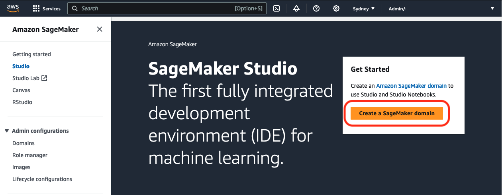

4\. Choose the **Quick setup** option and click **Set up**

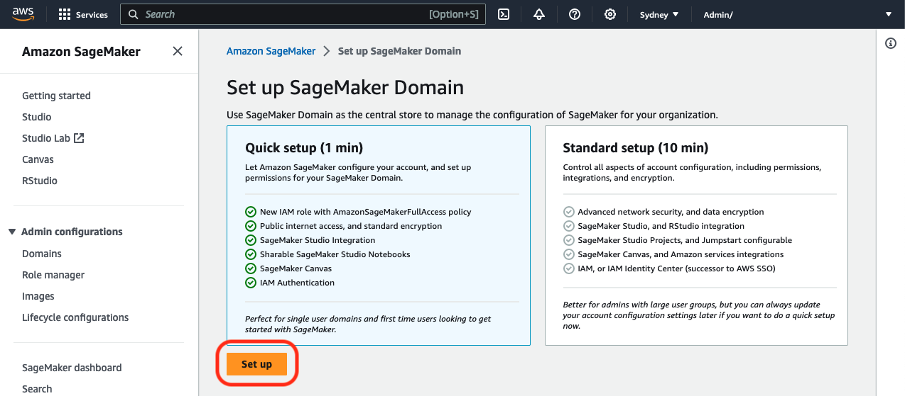

5\. Once the SageMaker Domain is ready, you will see a default user has been created. You can launch a number of different SageMaker Studio components with this user, select **Canvas** from the Launch menu. It will take a few minutes for your SageMaker Canvas environment to initialize. After it has started up, feel free to watch the short tutorials on importing datasets, as well as building, analyzing and using models.

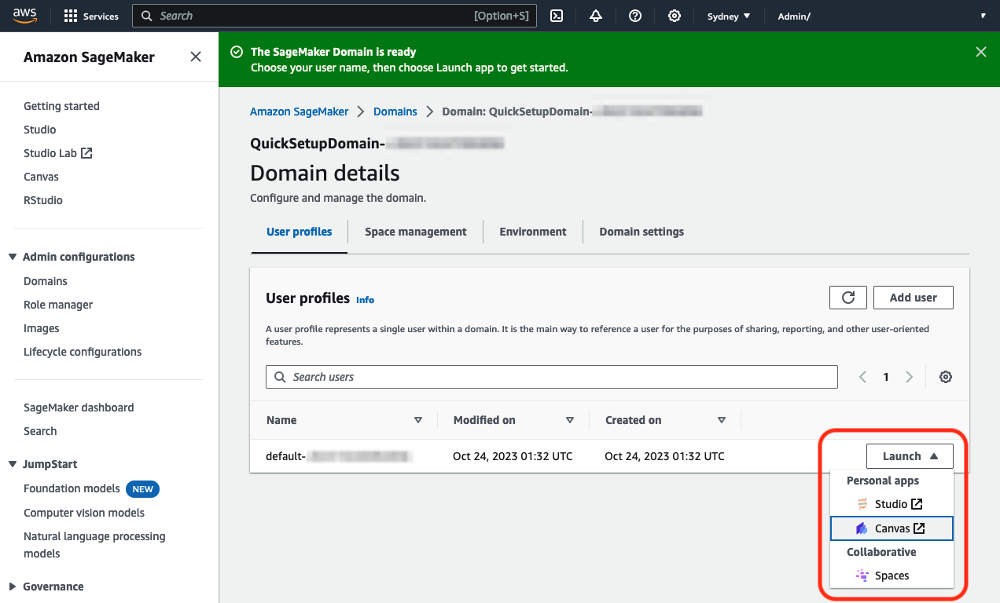

Your SageMaker Canvas environment should look something like this.

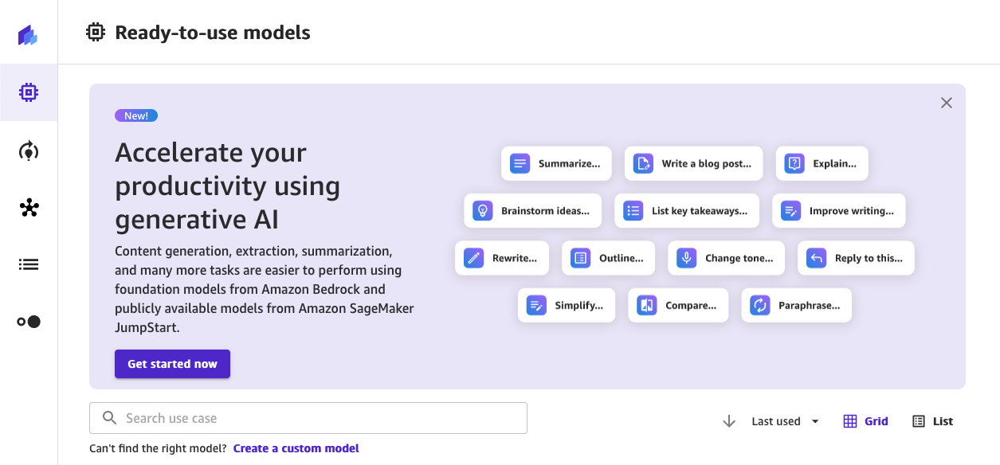

## Creating a Dataset

In order to build a model in SageMaker Canvas, we need to provide a training dataset. For our lab we'll be using some publicly available housing data from the Singapore [Housing and Development Board (HDB) Resale Flat Prices](https://beta.data.gov.sg/collections/189/datasets/d_8b84c4ee58e3cfc0ece0d773c8ca6abc/view). These datasets are quite large, ranging from 50k to 370k entries each. This amount of training data can provide quite an accurate model, however the training time is longer than we have time for in the lab. In order to make use of the Quick Training feature in SageMaker Canvas, we will use a truncated dataset with only 10k entries. You can download that file [here](data/resaleData.csv).

1\. Click on the Datasets icon in the left-hand side panel, and a page will open showing the included sample datasets. From the **Create** menu on the top right-hand side, choose the **Tabular** type to create a new CSV dataset. Call your dataset something like **housing-resale-data**

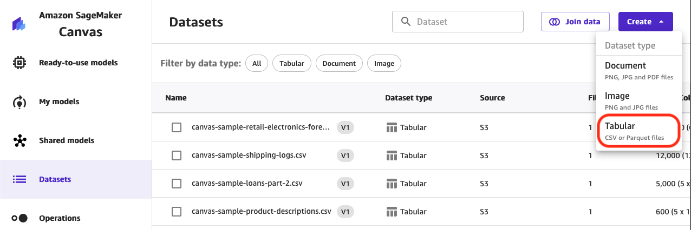

One of the great features of SageMaker Canvas is the ability to import datasets from a large number of sources, including your local machine (which we will use), services such as Amazon S3, Redshift, Athena and RDS from your AWS account, and external systems such as Snowflake and Databricks.

2\. We'll select **Local upload** and upload the [resaleData.csv](data/resaleData.csv) file from this lab, which you can download from the link above. Select Local upload and either drag and drop the CSV, or click **Select files from your computer** to use the file browser.

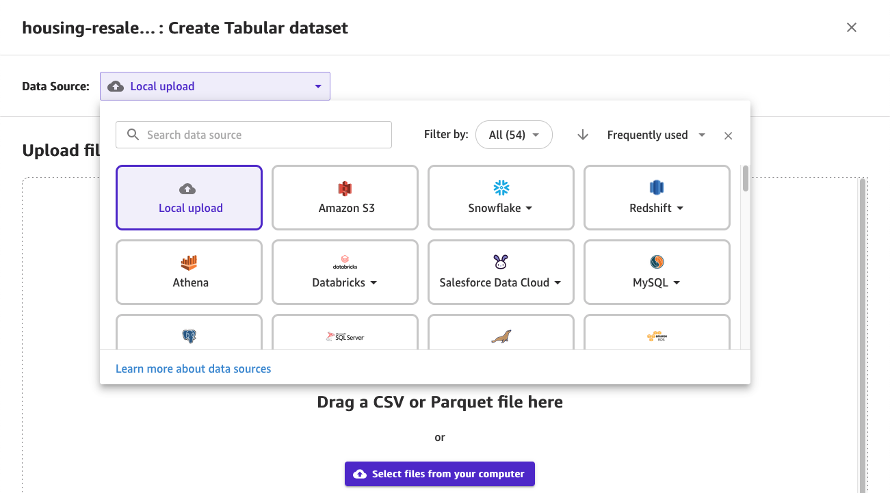

3\. Once the upload is complete, you can choose to preview your dataset, or just click **Create dataset**. If you choose to preview the dataset, it should look something like this.

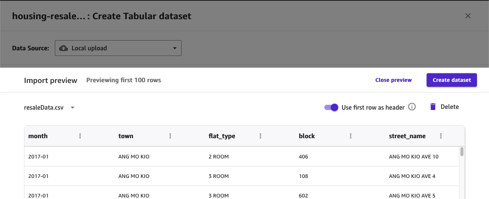

4\. Create the dataset and you'll be returned to the Datasets page, where you'll see your new dataset along with the included sample datasets.

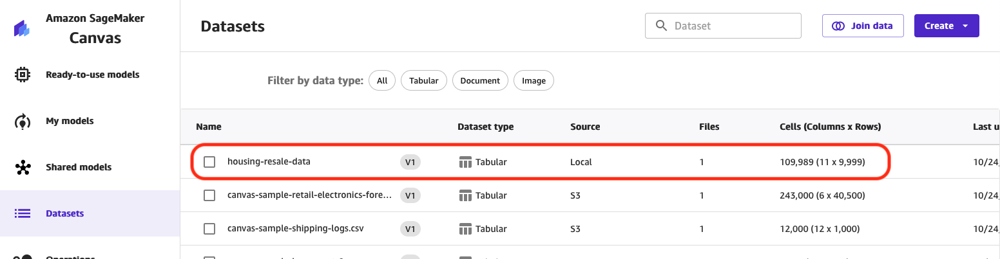

## Building a Model

Now that we've created a dataset out of our training data, we're ready to build a model which can predict resale prices.

1\. From the left-hand menu, select **My models**, which should show you an empty page. Click the **New model** buton at the top right-hand side.

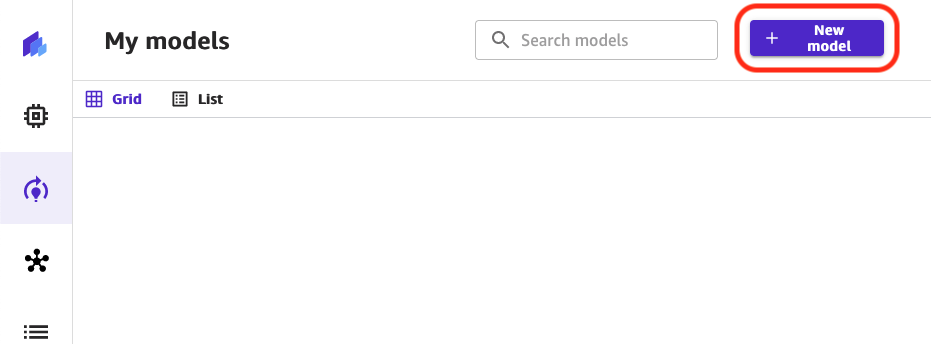

2\. Give your model a name like "Housing Resale" or "Housing Regression", and choose the **Predictive analysis** problem type. Click **Create**

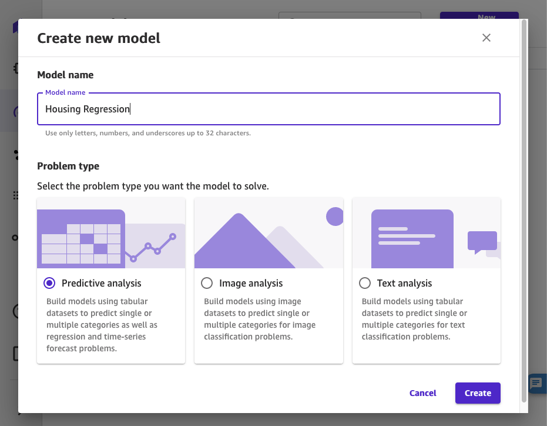

3\. On the **Select dataset** page, ensure that the dataset we created earlier is selcected, then click **Select dataset**

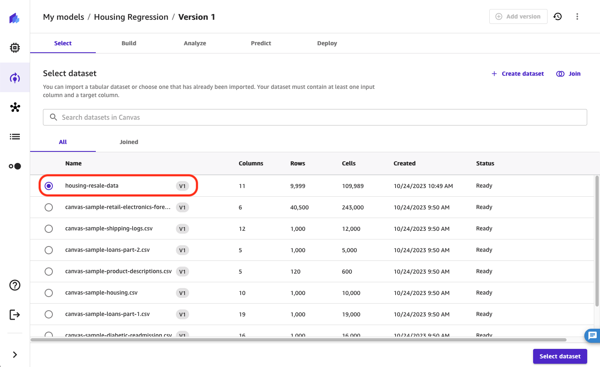

Once the dataset has loaded, SageMaker Canvas will display some schema information about your dataset. In the bottom half of the screen, you can take a look at some of the statistics of the dataset, including missing and mismatched values, unique vales, mean and median values. This can also be used to drop some of the columns, if we don't want to use them for the prediction, by simply un-checking them with the left checkbox. For this Lab, we're planning on using all of the available features. You can come back to this step later and try to change some of the features to see the impact on the model training.

Once you've explored this section, it's time to finally train the model! Before building a complete model, it is a good practice to have a general idea about the performances that our model will have by training a **Quick Model**. A quick model trains fewer combinations of models and hyper-parameters in order to prioritize speed over accuracy, especially in cases like ours where we want to prove the value of training an ML model for our use case. Note that quick build is not available for models bigger than 50k rows.

We need to configure our model build, with a couple of selections.

The first thing that we need to do is select a column to predict. Since we're interested in predicting resale prices of housing based off our dataset, we'll select **resale_price** as our Target column.

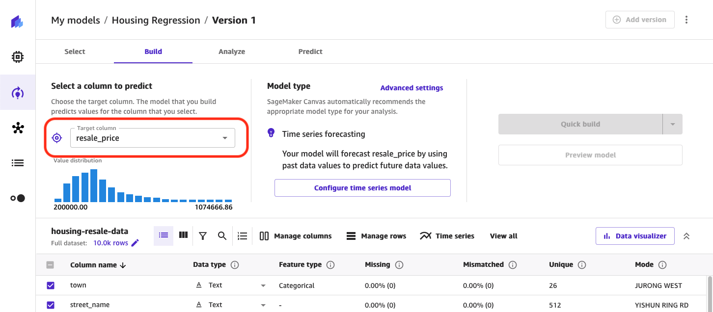

For Model type, SageMaker Canvas may default to Time series forecasting, however we're going to use Numeric prediction. Click on the **Advanced settings** in the Model type section, and choose **Numeric model type**, and click Save.

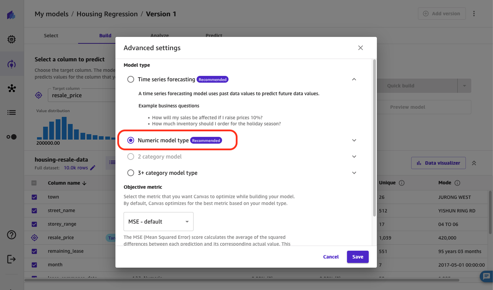

If we want to, we can click on the **Preview model** button to see how accurate SageMaker Canvas thinks our model will be, as well as what impact each column in the dataset has on the accuracy of the final model. Running the preview takes a few minutes, but gives us some insight into how successful our model will be.

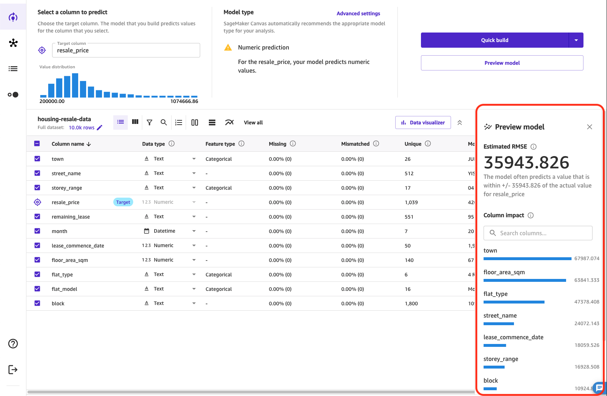

Let's leave all of the columns selected and click **Quick build**.

## Model Analysis

Once your model build has completed (this should only take about 5 minutes), you'll see some analysis of the model. Highlighted in bold at top of the page under **Model status** is a metric for our regression problem, called Root Mean Squared Error (RMSE). This represents a measurement for the spread of predictions, with a lower value indicating more accurate predictions of our target variable. This means that our prediction have a squared error of +/- $28k. Later we will be able to see how accurate our predictions are.

The first tab in the analysis section, **Overview**, shows us the estimated importance, or **Column impact**, of each column in predicting the target column. This view gives us information on those features which could give away our target label (this is called target leakage, when one feature importance is disproportionately high with respect to the others) or features that are irrelevant to the problem (very low feature importance). In our case, even the lowest of the column impacts is still significant, so we should not exclude any of them from our final model. Later we can remove some of them and see how this impacts the model.

In our case, the **town** column, followed by the **floor_area_sqm** column have the greatest impact on resale price. If we think about this like a human, it seems to make sense. Click through the columns listed on the left to see a statistical analysis of the input dataset.

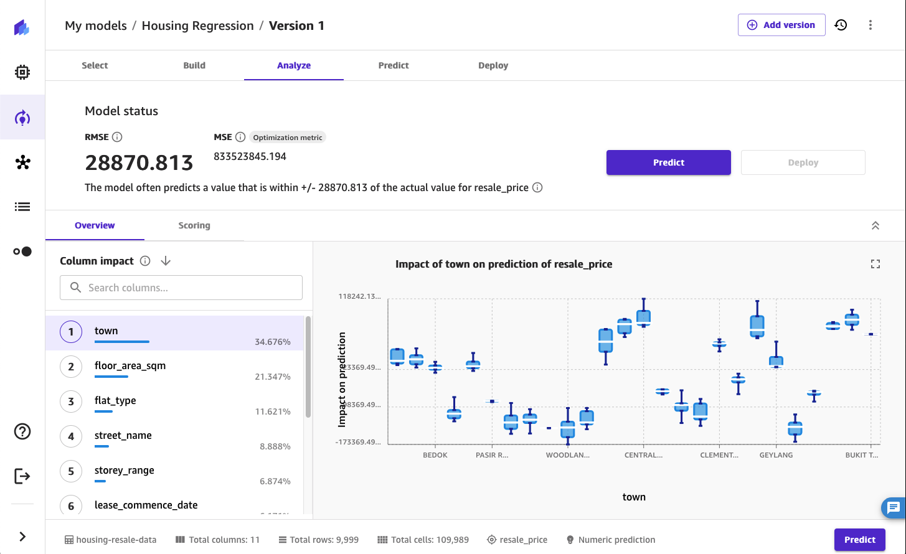

If you want to learn more about how Canvas uses SHAP baselines to bring explainability to Machine Learning, you can check the ["Evaluating Your Model's Performance in Amazon SageMaker Canvas" section](https://docs.aws.amazon.com/sagemaker/latest/dg/canvas-evaluate-model.html) of the Canvas documentation, as well as the page for [SHAP Baselines for Explainability](https://docs.aws.amazon.com/sagemaker/latest/dg/clarify-feature-attribute-shap-baselines.html).

If we now look at the **Scoring** tab, we can see the accuracy of our model. In this case, we're seeing quite an accurate prediction fit.

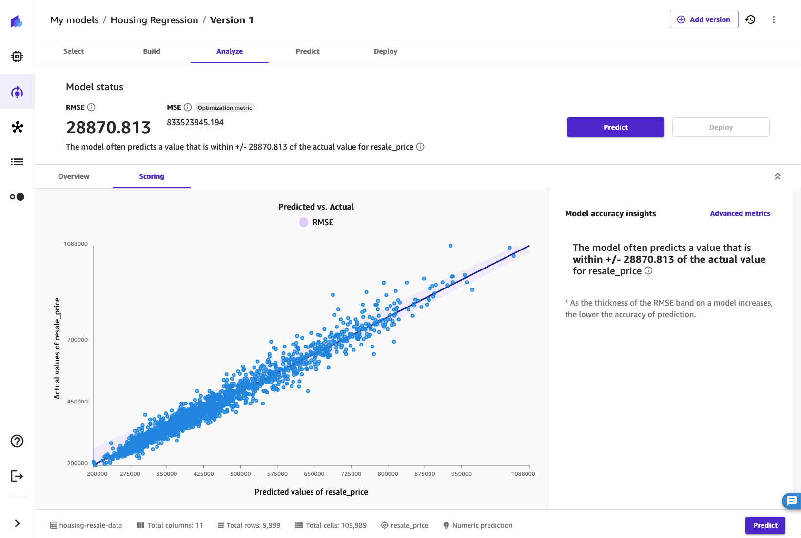

The plot displayed represents the distribution of our predicted values compared to the actual values. This allows us to compute another metric, the Mean Average Error (MAE), which shows our mean difference from the actual value to predict. You can inspect further metrics and get more knowledge by clicking on the **Advanced metrics** button on your right.

If we're happy with the accuracy of our Quick Model, we can use it to immediately run some predictions. We could also create a new Version of this model to train with the Standard Build process. This will take much longer, about 4-6 hours, but will be much more accurate.

For the sake of this lab, we will use the Quick Model to make some predictions.

Feel free to take your time later and run the Standard Build to see how much more accurate your model is.

> [!NOTE]
> Training a model with Standard Build is necessary to share the model with a Data Scientist with the SageMaker Studio integration. Predictions do not require the full build, however they can lack in performance compared to a fully-trained model.

## Making Predictions

Now that the model is trained, we can use it to make some predictions. From the **Analyze** page, click on the **Predict** button at the bottom of the page. The **Predict** page will open, it should look something like this.

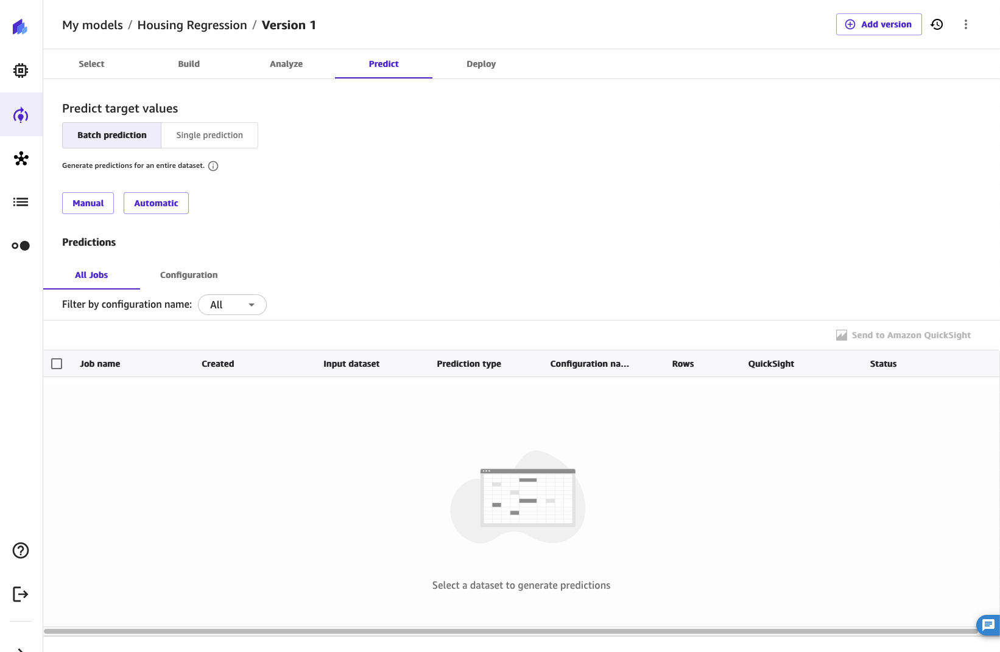

Leave **Batch prediction** selected, then click the **Manual** button below it. A page will open for you to select a Dataset, choose the dataset we created earlier, then click the **Generate predictions** button.

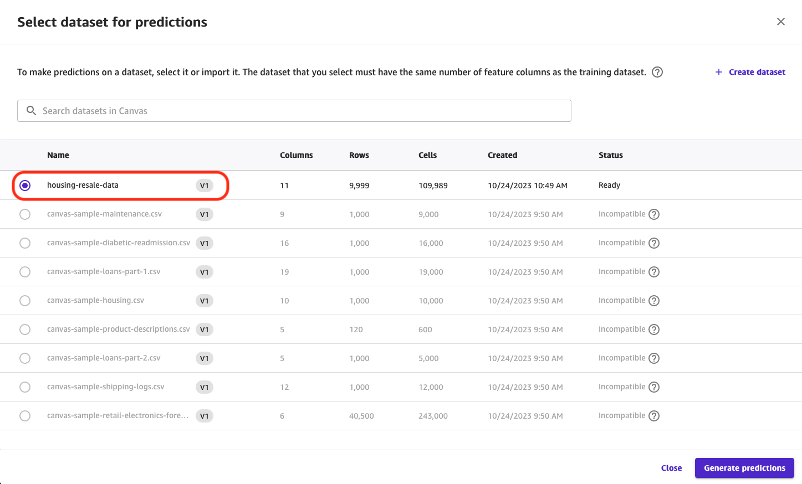

SageMaker Canvas will use this dataset to generate our predictions. Although it is generally a good idea not to use the same dataset for both training and testing, we're using the same dataset for the sake of simplicity. You can also import another dataset in the selection view if you desire. After a few seconds, the prediction is done and you can click on the extended menu under the status columnto see a preview of the predictions, or click the download button to download a CSV file containing the full output.

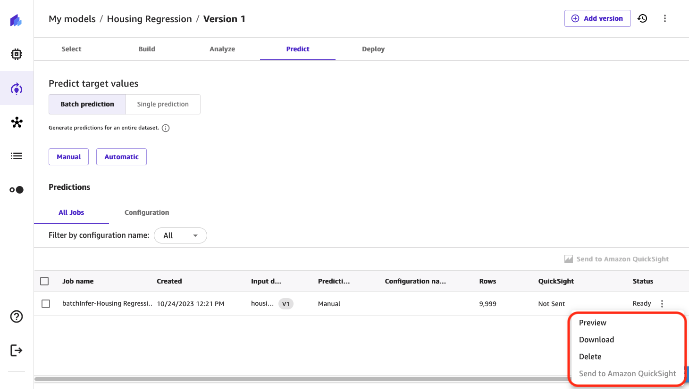

If you download the CSV and compare it to the [resaleData.csv](data/resaleData.csv) file we uploaded earlier and then used to train the model, you can see the predicted **resale_price** values compared with the actual values.

It is also possible to predict single values, by selecting Single prediction instead of batch prediction. Canvas will show you a view where you can provide manually the values for each feature, and generate a prediction.
This allows you to see how changing features of the property affect the resale value. What happens if we change the flat type from 2-room to 4-room? How does resale price change with floor area, or flat model?

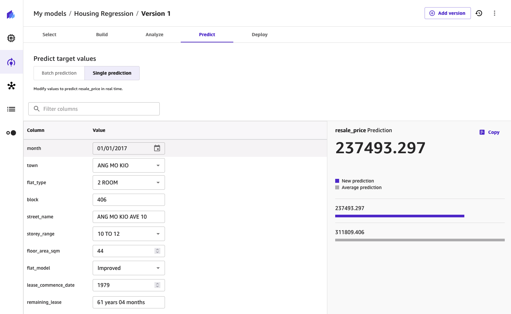

**Congratulations!** You've succesfully completed this lab, where you built a predictive analysis numerical model to predict the resale value of an apartment based on several criteria, and all without writing a single line of code.

If you wish to continue exploring SageMaker Canvas, you could do one of the following

- See if you can improve your RMSE with the Quick Build by changing which columns are included. You can always go back to the [Model Analysis](#model-analysis) steps to see which columns had the most impact on prediction in your model.

- Go back and build another model using the same dataset, only this time use the Standard build and see how its performance compares to the Quick Build.
- Use your existing model to make predictions on a different dataset than the one used to train the model. To do this, create a new Dataset using the [predictionDataset.csv](data/predictionData.csv) file in this repository. This file is in the same format as [resaleData.csv](data/resaleData.csv), but with data from an earlier time period.
- Build a new model from a much larger dataset. The datasets we've used in this lab are from Singapore's [Housing and Development Board (HDB) Resale Flat Prices](https://beta.data.gov.sg/collections/189/datasets/d_8b84c4ee58e3cfc0ece0d773c8ca6abc/view). You can download the full datasets from the link above.

## Cleanup

> [!WARNING]
> SageMaker Canvas will not automatically shut down its resources if you do not log out!

Click on the **Logout** button at the bottom of the left-hand panel to ensure that SageMaker Canvas shuts down any resources it is using. Your Datasets and Models will not be deleted, and you can access them again in the future by opening SageMaker Canvas again from the AWS Console.
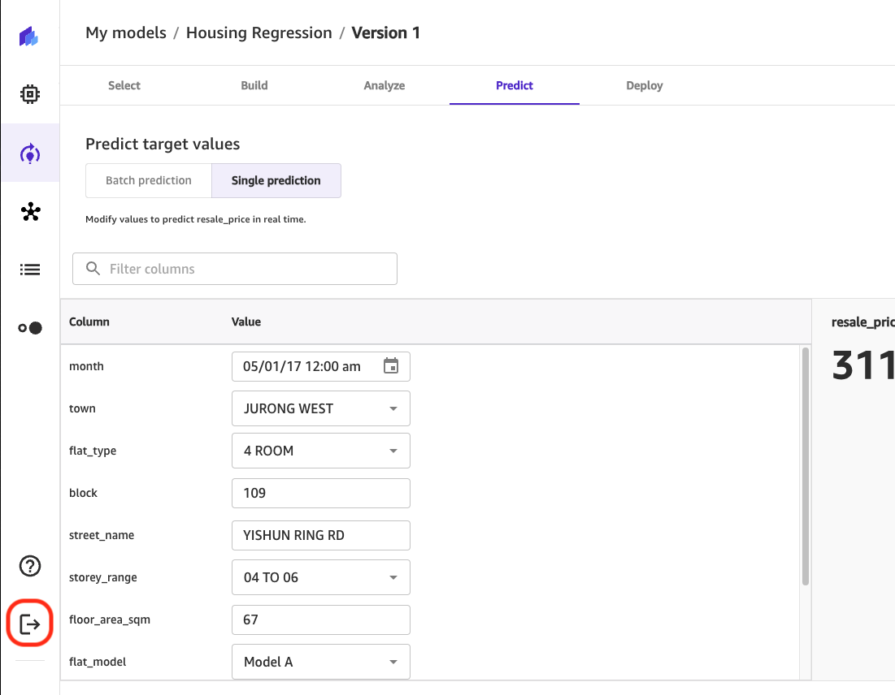
